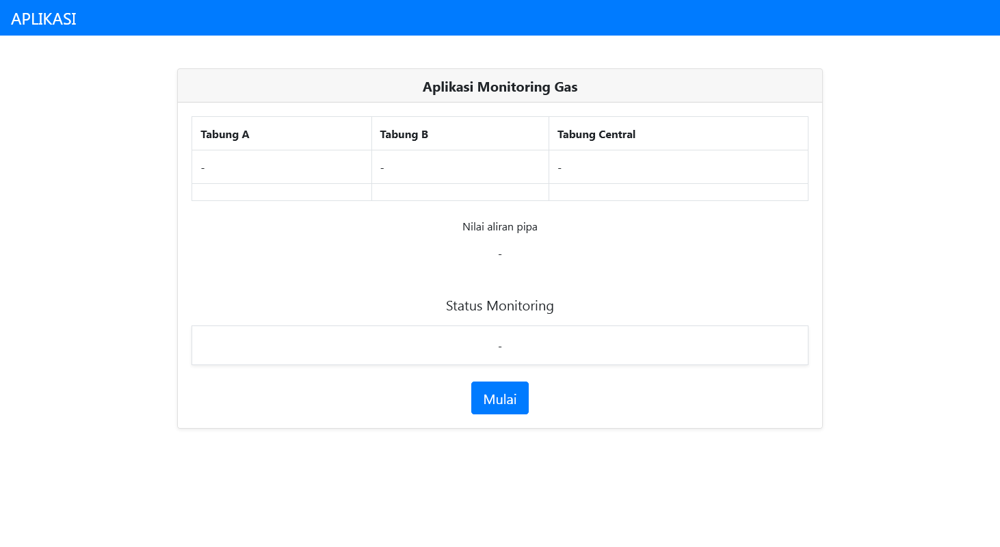

# Gasapp Project - Gas Pump Reading Web-Based Application

Created with Python, Flask, and jQuery.

## Description

This project was part of client's thesis is about reading raw data from pump gas and displaying them in webpage.
Python were used as a middleware software to connect the device to web application.
with Flask as web application framework.
jQuery works as an AJAX to read raw data from endpoint automatically.

## Tech Stack

- Python
- Flask
- HTML
- Bootstrap CSS
- jQuery

## Screenshot

## Date Launch

This repo has been completed on November 29, 2022.
